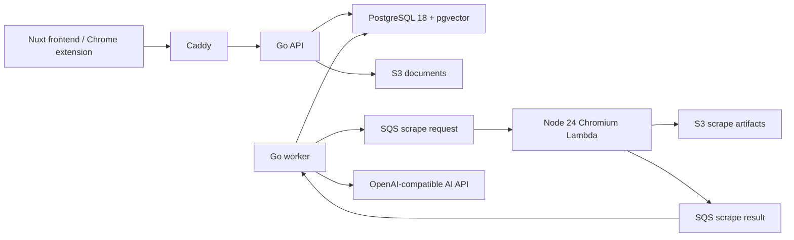

# 시스템 아키텍처

## 배포 단위

OCI 인스턴스 한 대에는 Caddy, Go API, Go worker, PostgreSQL 18 + pgvector만 둡니다. AWS에는 S3/CloudFront, SQS/DLQ, Node 24 scraping Lambda, SES만 둡니다. Redis, Kafka, Kubernetes, Temporal은 현재 규모에서 운영 비용과 장애 지점만 늘리므로 사용하지 않습니다.

## 모듈 경계

- `identity`: OTP challenge, 가입/로그인, JWT와 refresh rotation, 비밀번호 재설정/탈퇴
- `account`: 프로필, role/plan, 저장 용량
- `library`: 문서, tag, collection, 안정적인 created cursor
- `filestore`: multipart 검증, quota transaction, S3 업로드/다운로드
- `retrieval`: PostgreSQL lexical + pgvector 후보와 RRF 결합
- `chat`: 검색 근거 구성과 기존 frontend 호환 SSE
- `worker`: outbox 발행, scrape result inbox 처리
- `enrichment`: chunk, embedding, summary, current version 조건부 완료

모듈러 모놀리스라 한 프로세스 안에서는 함수 호출을 사용합니다. 느리거나 재시도가 필요한 경계만 SQS 이벤트나 DB job으로 분리합니다. DB table을 Lambda와 공유하지 않습니다.

file/image upload도 항상 version과 ENRICH job을 만듭니다. UTF-8 text는 바로 chunking하고, PDF는 Go에서 text layer를 page별로 추출하며, image는 multimodal AI로 설명+OCR한 뒤 같은 embedding pipeline에 합류합니다. AI 분석 한 번에서 summary와 대표 tag 3~5개를 구조화 JSON으로 만들고, chunk/vector/summary/tag/document/job을 같은 transaction으로 교체합니다. soft delete는 cleanup job을 같은 transaction에 기록하고 worker가 document/artifact bucket의 모든 version key를 멱등 삭제합니다.

## 수집 상태 전이

`WEBPAGE` 생성 transaction은 document/version/SCRAPE job/outbox를 함께 기록합니다. outbox dispatcher가 요청 SQS에 발행합니다. Lambda는 S3 artifact와 결과 이벤트만 만들며 DB를 모릅니다. 결과 worker는 inbox `eventId`, job/document/version 일치, current version을 검사합니다. 오래된 결과는 현재 문서를 덮어쓰지 않습니다. 성공하면 ENRICH job을 만들고, enrichment worker가 chunk/vector/summary/version/document/job을 한 transaction으로 완료합니다.

## 장애 모델

- PostgreSQL commit 전 장애: outbox도 없으므로 외부 부작용 없음
- SQS publish 전후 장애: lease가 만료된 outbox 재시도, Lambda/consumer idempotency로 중복 흡수
- Lambda 부분 실패: `ReportBatchItemFailures`, 요청 큐 3회 후 실패 결과 발행
- 결과 중복: inbox event와 terminal job 상태로 no-op
- 이전 version의 늦은 결과: version에는 기록할 수 있지만 current document는 변경하지 않음
- AI 장애: hybrid search는 lexical로 degrade, enrichment job은 exponential backoff

## 검색

제목/요약/본문의 weighted `tsvector`, trigram 후보 50개와 chunk cosine 후보 50개를 가져옵니다. 두 순위를 RRF(k=60)로 결합해 점수 척도가 다른 lexical/vector를 안전하게 합칩니다. HNSW 검색은 pgvector 0.8의 relaxed iterative scan으로 owner/current-version 필터 뒤에도 후보를 채우고, materialized 후보를 strict distance 순으로 다시 정렬합니다. RAG는 상위 5개 문서, 문서당 최대 2개 chunk만 prompt에 넣고 문서 안의 명령을 따르지 않도록 system prompt에서 격리합니다.
