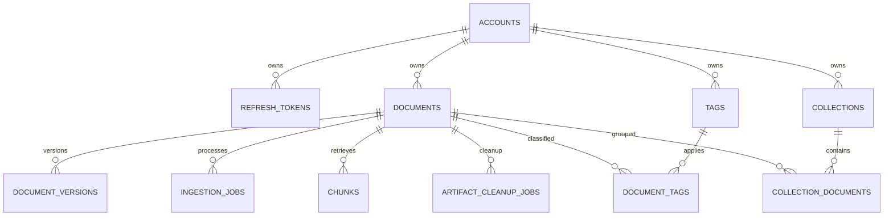
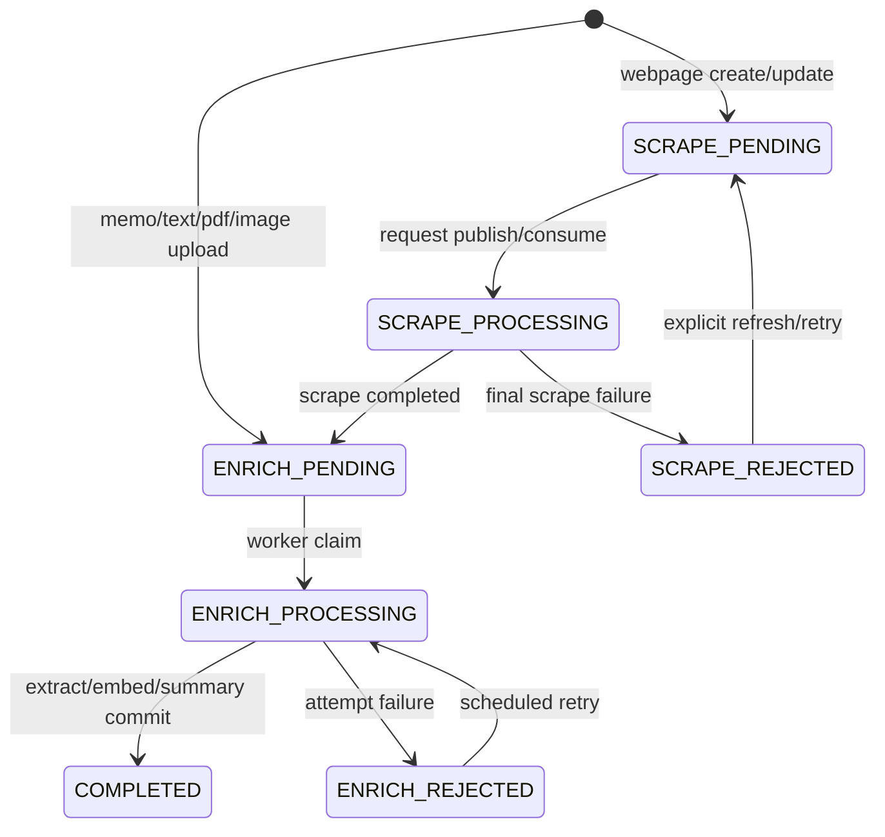

# 데이터 모델과 상태 전이

## 핵심 entity

- `accounts`: UUIDv7 account, unique case-insensitive email, bcrypt password hash, internal role/plan. soft-withdraw은 account 자체를 삭제해 cascade합니다.
- `verification_challenges`: signup/reset/withdraw 목적별 HMAC OTP, attempt/expiry/verified/consumed audit.
- `refresh_tokens`: opaque token의 SHA-256 hash만 저장. 사용 시 revoke하고 새 token을 발급합니다.
- `documents`: client가 보는 현재 projection. owner, type, source/content/summary/status/current version과 안정적인 생성/수정 시간을 가집니다.
- `document_versions`: 비동기 작업의 immutable 기준. raw/content S3 key, media type, content hash, extraction method를 보존합니다.
- `ingestion_jobs`: SCRAPE/ENRICH/THUMBNAIL의 attempt, lease에 준하는 processing timestamp, backoff, terminal state.
- `outbox_events` / `inbox_events`: DB↔SQS dual-write와 at-least-once 중복을 흡수합니다.
- `chunks`: version별 text chunk와 model 이름, vector(1536). document current version과 맞는 chunk만 검색합니다.
- `artifact_cleanup_jobs`: soft-deleted document의 모든 version artifact를 worker가 재시도 삭제합니다.
- taxonomy table: tag/collection 모두 owner를 가지며 관계 생성 시 document owner와 일치해야 합니다.

## document 상태

`DRAFT`는 schema에 예약되어 있지만 현재 공개 create API는 바로 pending으로 들어갑니다. `SCRAPE_PROCESSING`은 request가 외부에서 처리되고 있음을, `ENRICH_PROCESSING`은 Go worker가 current version을 처리하고 있음을 뜻합니다. status는 결과 표시용 projection이고 재시도 진실의 원천은 job state/attempt입니다.

## job 상태

- `QUEUED`: 실행 가능. `available_at` 이전이면 기다립니다.
- `PROCESSING`: worker가 claim. 10분 이상 갱신되지 않으면 crash lease로 보고 재claim할 수 있습니다.
- `SUCCEEDED`: terminal success. 중복 result는 no-op 가능합니다.
- `FAILED`: backoff 후 재claim 가능. ENRICH는 최대 5회, artifact cleanup은 최대 10회입니다.
- `CANCELLED`: schema에 예약. 최신 version이 바뀐 과거 job은 현재 document를 변경하지 않고 사실상 terminal no-op 처리합니다.

## 왜 document와 version을 둘 다 두는가

client list/search는 매번 version join을 하지 않고 `documents` projection을 빠르게 읽습니다. 반면 Lambda result는 만들어졌을 때의 version에만 쓸 수 있어야 합니다. 따라서 worker transaction은 version row에 결과를 기록한 뒤 `documents.current_version == result.documentVersion`일 때만 projection을 갱신합니다. 이 조건이 늦게 도착한 작업이 새 수정본을 덮는 것을 막습니다.

## index

- owner별 list: partial B-tree `(owner_id, created_at DESC, id DESC) WHERE deleted_at IS NULL`
- 제목/본문 typo 후보: `pg_trgm` GIN
- lexical: title A, summary B, content C weight의 generated `tsvector` GIN
- semantic: chunk embedding cosine HNSW
- outbox/job/cleanup: pending/available_at 중심 partial index

HNSW는 vector 전체에 걸리고 query가 owner/current version을 join-filter합니다. 필터 때문에 근접 후보가 버려져 결과 수가 모자라는 일을 줄이도록 pgvector 0.8의 `hnsw.iterative_scan=relaxed_order`를 query-local 설정으로 켭니다. relaxed 후보를 materialized CTE에 모은 뒤 PostgreSQL 18의 권장 형태인 `distance + 0`으로 최종 strict 정렬합니다. 계정 수와 chunk가 크게 늘어 이 방식의 scan tuple 상한이 문제가 될 때만 owner hash partitioning을 검토합니다.

## 삭제와 보존

개별 삭제는 document soft delete, artifact cleanup job, tag/collection 관계 제거를 한 transaction으로 처리합니다. 탈퇴는 account와 모든 active document를 soft delete하고 각 document cleanup job을 생성하며 refresh token을 revoke합니다. 이미 실행 중인 Lambda가 삭제 뒤 결과를 보내면 worker가 version artifact key를 기록한 후 cleanup job을 다시 QUEUED로 돌립니다. cleanup과 늦은 결과가 동시에 와도 job state 조건 때문에 마지막 artifact까지 다시 삭제됩니다.

탈퇴 transaction은 email을 `{accountId}@deleted.remak.invalid`로 치환하고 password/name/image와 해당 email의 challenge를 즉시 제거하므로 같은 email로 재가입할 수 있습니다. worker maintenance는 1시간마다 expired challenge/refresh token, 30일 지난 inbox/published outbox/succeeded job을 정리합니다. artifact cleanup이 성공하고 soft delete 후 30일 지난 개별 document를 hard delete하며, 탈퇴 account는 늦은 SQS/Lambda 결과를 흡수할 7일을 둔 뒤 모든 cleanup 성공 조건에서 cascade hard delete합니다. dead-letter outbox는 조사 기간을 위해 90일 보존합니다.
